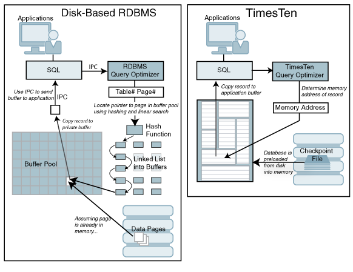

# Introduction

## About this Workshop

*Oracle TimesTen In-Memory Database* is a lightweight, fully featured, relational in-memory database
that offers **unrivalled performance**, simple installation and management, and high performance high-availability.
It is well suited to running in containerized environments and, combined with the *TimesTen Kubernetes Operator*,
provides a simple and robust solution for high performance, highly available data management in Kubernetes environments.

**Oracle TimesTen In-Memory Database** (TimesTen) is a relational database that is memory-optimized for fast response and throughput.
You can create one or more in-memory, SQL relational, ACID-complaint databases.
The database resides entirely in memory at runtime and is persisted to the file system for the ability to recover and restart.

* *Oracle TimesTen In-Memory Database in classic mode (TimesTen Classic)* is a memory-optimized relational database that provides
applications with the responsiveness and high throughput. High availability for the in-memory database is provided through transactional replication.

* *Cache* is ideal for caching performance-critical subsets of an Oracle database for improved response time in the application tier.
Cache tables can be read-only or updatable. Applications read and update the cache tables using standard SQL,
and data synchronization between the cache and the Oracle database is performed automatically.
Cache offers applications the full generality and functionality of a relational database,
the transparent maintenance of cache consistency with the Oracle database, and the high performance of an in-memory database.

**Oracle TimesTen In-Memory Database Performance Overview**

The TimesTen in-memory database delivers high performance by changing the assumptions about where data resides at runtime.
The TimesTen in-memory database manages data in memory and optimizes data structures and access algorithms accordingly.
Thus, database operations run with maximum efficiency, achieving dramatic gains in responsiveness and throughput,
even compared with a fully cached, the file system-based relational database management system (RDBMS). 

* Much of the work that is done by a conventional RDBMS is done under the assumption that data primarily resides on the file system.
Optimization algorithms, buffer pool management, and indexed retrieval techniques are designed based on this fundamental assumption.

* TimesTen is designed with the knowledge that data resides in main memory and can take more direct routes to data,
reducing the length of the code path and simplifying algorithms and structure.

* When the assumption of the file system is removed, complexity is dramatically reduced.
The number of machine instructions drops, buffer pool management disappears, extra data copies are not needed,
index pages shrink, and their structure is simplified. The design becomes simple and more compact, and requests are processed faster.
The figure shows the simplicity of the TimesTen design.

    

The *TimesTen Operator* is designed for simple deployment of your active standby pairs of *TimesTen Classic databases*
and for automated failure detection and recovery. For example,
* You decide you want to deploy a new replicated pair of TimesTen databases.
* You decide the attributes of those databases.
* You create the configuration files for those attributes.
* You use the `kubectl create` command to create a TimesTenClassic object to represent the replicated pair.
* You use the `kubectl get` and `kubectl describe` commands to observe the provisioning of the active standby pair.
* Applications that run in other Pods use TimesTen's standard client/server drivers to access TimesTen databases.

You **do not have** to monitor the TimesTen databases continually, configure replication, perform failover,
or re-duplicate a database after failure. **The TimesTen Operator performs all these functions and works
to keep the databases up and running with minimal effort on your part**.

This lab shows you how to deploy and run an *Oracle TimesTen* inside a Kubernetes
cluster, using the *Oracle TimesTen In-Memory Database Kubernetes Operato*r.  
We will setup a *Container Engine for Kubernetes (OKE)* and deploy
- Active Standby Pair
- TimesTen Cache connected to Oracle Containerized Database.
- TimesTen Cache connected to Oracle Autonomous Database.
- TimesTen Cache connected to Oracle Database Cloud Service.

### Objectives

* Set up a Container Engine for Kubernetes on the Oracle Cloud Infrastructure
* Install the TimesTen Kubernetes Operator
* Configure and launch a Timesten Database on Kubernetes
* Configure and launch a Oracle Autonomous Database on Kubernetes
* Configure and launch a Timesten Cache Database on Kubernetes
* Destroy the environments

### Prerequisites

* Access to an Oracle Cloud account

You may now **proceed to the next lab**.

## Learn More

* [Oracle TimesTen In-Memory Database Kubernetes Operator User's Guide](https://docs.oracle.com/en/database/other-databases/timesten/22.1/kubernetes-operator/index.html)

## Acknowledgements
* **Author** - Dario VEGA, February 2023
* **Last Updated By/Date** - Dario VEGA, February 2023
